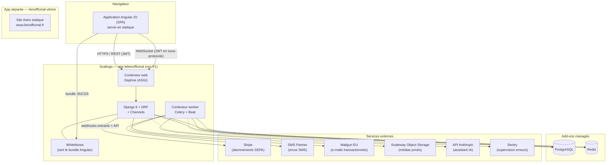

# 03 — Architecture générale

> **Compétences DWWM couvertes ici :** vision d'ensemble mobilisée par CP2, CP3
> (front sécurisé) et CP5, CP6, CP7 (back sécurisé). Le détail par bloc est dans les
> chapitres [05](05-frontend-angular.md) et [06](06-backend-django.md).

## 3.1 Vue d'ensemble

Le Lien Officinal est une **application web monopage (SPA)** Angular consommant une
**API REST** Django, complétée par des **WebSockets** pour le temps réel (messagerie,
notifications de tâches, statut des SMS, assistant IA). Un **worker asynchrone** Celery
traite les envois d'e-mails et de SMS, la génération de PDF de facturation et les
purges RGPD nocturnes.



**Points structurants :**

- **Mono-application de déploiement.** Le frontend et le backend vivent dans un même
  dépôt et sont déployés sur **une seule application Scalingo**. Django sert lui-même
  le bundle Angular compilé via WhiteNoise ; le SPA et l'API partagent donc la même
  origine en production (pas de CORS, cookies same-site stricts).
- **Serveur ASGI.** Le conteneur web tourne sous **Daphne** (et non Gunicorn) parce
  que l'application expose des WebSockets via Django Channels ; HTTP et WebSocket
  passent par le même process ASGI.
- **Redis unique, trois usages.** Broker + backend de résultats Celery, *channel
  layer* Channels, et cache (throttling DRF, verrous IA). Deux configurations de cache
  cohabitent avec des politiques opposées (voir [§3.4](#34-résilience)).
- **Séparation des données patient.** Les contenus de messagerie sont chiffrés au
  repos (données de santé) ; les médias sont stockés hors de l'application dans un
  bucket privé à URLs signées.
- **Site vitrine découplé.** `www.lienofficinal.fr` est un site Astro statique, dépôt
  et application Scalingo distincts ; il n'a aucun lien de code avec la plateforme.

## 3.2 Organisation du dépôt (monorepo)

```
lelienofficinal/
├── backend_lien_officinal/       # Projet Django
│   ├── backend_lien_officinal/   # settings, urls, asgi, celery
│   └── apps/                     # 10 apps métier (core, team, resources, planning…)
├── frontend-lien-officinal/      # Projet Angular (SPA)
│   └── src/app/{core,shared,features,admin}
├── landingpages/                 # Vitrine Astro — dépôt Git séparé (gitignore)
├── docs/                         # Cette documentation
├── .github/workflows/            # CI/CD (ci.yml, zap-scan.yml)
├── Procfile · .buildpacks · Aptfile · requirements.txt · .python-version
└── bin/pre_compile               # Hook de build Scalingo : compile Angular
```

Le monorepo simplifie la cohérence des versions (un commit = un état front+back
déployable) et le pipeline unique. Le prix à payer : un buildpack Python qui doit
aussi installer Node et compiler Angular (voir [chapitre 10](10-deploiement-exploitation.md)).

## 3.3 Stack technique et justification des choix

| Besoin | Choix | Pourquoi ce choix |
|---|---|---|
| Interface riche, temps réel, hors-ligne partiel | **Angular 20**, composants **standalone** (zéro `NgModule`) | Framework « batteries incluses » (routing, formulaires, HTTP, DI) → moins de dépendances tierces à auditer. Le passage 100 % standalone supprime le boilerplate des modules et améliore le *tree-shaking*. |
| API métier structurée | **Django REST Framework** | ORM mature, migrations, admin, écosystème sécurité. DRF fournit sérialiseurs, permissions et *throttling* prêts à l'emploi. |
| Authentification stateless | **SimpleJWT** (jeton d'accès court + *refresh* en cookie HttpOnly) | Pas de session serveur à répliquer ; le cookie HttpOnly protège le *refresh* du vol par XSS. |
| Temps réel | **Django Channels** + `channels-redis` | Reste dans l'écosystème Django (mêmes modèles, même ORM dans les *consumers*), Redis déjà présent. |
| Tâches longues / différées | **Celery** (broker Redis) | E-mails, SMS, PDF (WeasyPrint) et purges RGPD ne doivent pas bloquer le cycle requête/réponse. |
| Base de données | **PostgreSQL** en production, **SQLite** en développement | PostgreSQL pour les contraintes `CHECK`, les index partiels et la robustesse ; SQLite pour un démarrage local sans dépendance. |
| Style | **Tailwind CSS**, aucune librairie de composants | Contrôle total du rendu, pas de surcharge d'un *design system* tiers ; les composants (modales, sélecteur de PIN, tiroirs) sont faits maison. |
| Hébergement | **Scalingo** (PaaS français, région `osc-fr1`) | Hébergement en France (enjeu données de santé), déploiement Git, add-ons managés PostgreSQL/Redis, pas d'ops infra à gérer au stade MVP. |

## 3.4 Résilience

Le cache Redis porte deux configurations aux politiques **opposées et assumées**
(`backend_lien_officinal/settings.py:446-476`) :

- **`default` — *fail-open*.** Backend maison `apps.core.cache.ResilientRedisCache`.
  Si Redis a un hoquet, le cache renvoie « vide » au lieu de lever : le *throttling*
  DRF se dégrade au lieu de renvoyer une 500. Des *timeouts* courts (1 s / 2 s) sont
  indispensables, sans quoi un socket mort figerait l'unique thread ASGI.
- **`admin_revocation` — *fail-closed*.** Cache Redis natif qui **lève** si Redis est
  injoignable. La liste de révocation des jetons admin s'appuie dessus : on ne veut
  **jamais** accepter un jeton admin révoqué parce que Redis n'a pas répondu (audit
  `S21`).

Le calcul du droit d'accès aux modules payants
(`Subscription.is_access_allowed`) est **dérivé des dates** et ne dépend donc ni de
Celery ni de Redis : même worker à l'arrêt, un essai expiré perd l'accès.

## 3.5 Flux de bout en bout — exemple : ouvrir le planning

1. L'utilisateur clique sur « Planning ». Le `Router` Angular déclenche `authGuard`
   puis `paidAccessGuard`.
2. `paidAccessGuard` interroge `SubscriptionStateService` (état en cache, signal
   Angular). Accès ouvert → la route s'active.
3. Le composant appelle `GET /api/planning/shifts/?week=…`. L'intercepteur HTTP
   attache `Authorization: Bearer <access>`.
4. Django : `JWTAuthentication` valide le jeton → `IsAuthenticated` → `HasPaidAccess`
   relit l'abonnement en base. Si l'essai a expiré entre-temps, réponse **402** ;
   l'intercepteur affiche un toast, invalide le cache d'abonnement et redirige vers
   la facturation.
5. Sinon la vue filtre `Shift.objects.filter(pharmacy=request.user, …)` (isolation
   multi-tenant) et renvoie le JSON sérialisé.
6. En parallèle, le composant messagerie tient une **WebSocket** ouverte
   (`wss://…/ws/messaging/…`), le jeton étant passé en **sous-protocole** et non en
   *query string* (pour ne pas fuiter dans les logs des proxys).

Le détail de chaque couche est développé dans les chapitres suivants.
