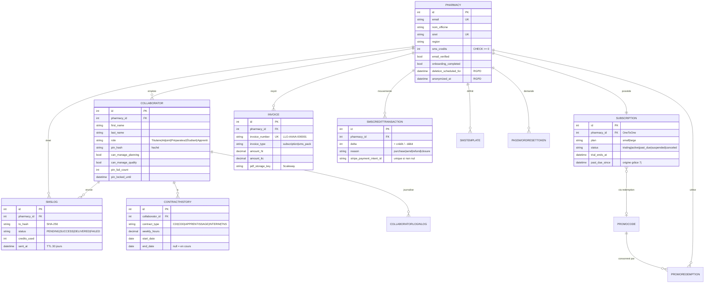
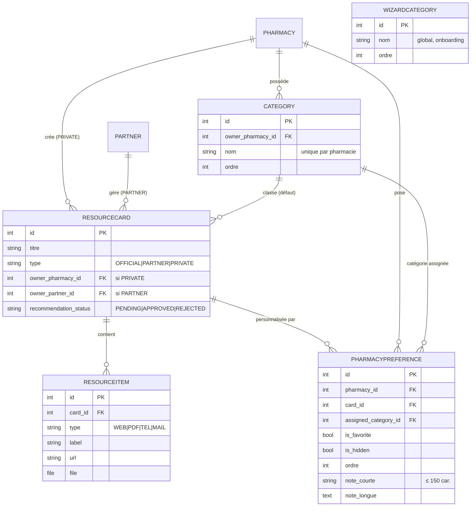
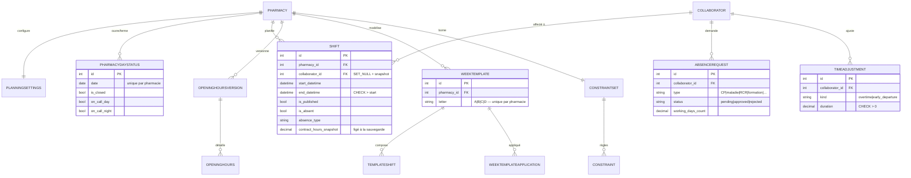
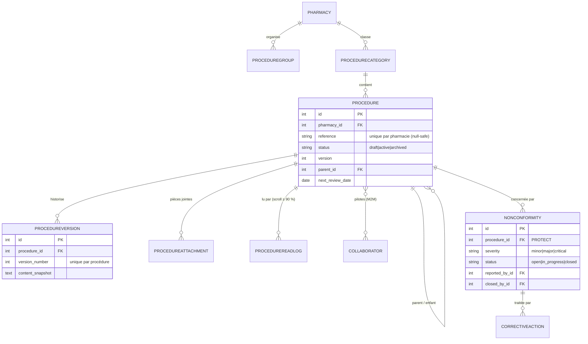

# 07 — Modèle de données

> **Compétence DWWM couverte ici :** **CP5** — Créer une base de données (modélisation
> entité-association, contraintes d'intégrité, index).

## 7.1 Principes transverses

### Multi-tenant par le modèle utilisateur

`AUTH_USER_MODEL = core.Pharmacy` : **l'utilisateur authentifié *est* la pharmacie**.
Il n'y a pas de table « tenant » séparée. Presque tous les modèles portent une clé
étrangère `pharmacy` (ou `owner_pharmacy`) vers `Pharmacy`, et chaque `get_queryset`
de l'API filtre dessus. Des tests de non-régression verrouillent l'isolation
(`tests/test_isolation.py`, `apps/core/tests/test_audit_idor_20260709.py`).

### Overlay de préférences (`PharmacyPreference`)

Les cartes de ressources `OFFICIAL` et `PARTNER` sont **partagées** entre toutes les
pharmacies (catalogue commun maintenu par l'admin ou les laboratoires). Chaque
officine pose par-dessus une **surcouche** `PharmacyPreference`
(`unique_together (pharmacy, card)`) : favori, masquage, catégorie assignée, note
courte, note longue, ordre d'affichage. Les vues créent cette ligne à la volée via
`get_or_create` lors de la première personnalisation.

### Secrets et données sensibles

| Donnée | Traitement |
|---|---|
| Mot de passe pharmacie | `AbstractBaseUser` — haché (PBKDF2) |
| PIN collaborateur | `pin_hash` — `make_password` / `check_password`, jamais en clair |
| Contenu des messages, objet de conversation | **`EncryptedTextField`** — chiffré au repos (Fernet) |
| Secret TOTP admin | `Fernet` (clé dédiée `ADMIN_TOTP_KEY`) |
| Numéro de téléphone destinataire SMS | **SHA-256** (`to_hash`) — le numéro en clair n'est jamais stocké |

### Contraintes et index PostgreSQL

`django.contrib.postgres` est activé pour utiliser :
- des **`CheckConstraint`** métier : `sms_credits >= 0`, `end_datetime > start_datetime`
  sur les shifts, `duration > 0` sur les ajustements horaires, énumérations de statut… ;
- des **index partiels** : `Procedure` active, `CollaboratorLoginLog` sur les échecs
  uniquement, unicité de `stripe_payment_intent_id` quand non nul.

## 7.2 Cœur : authentification, équipe, facturation

`Subscription.is_access_allowed` est une **propriété calculée** (pas une colonne) :
elle dérive le droit d'accès des dates (`trial_ends_at`, `past_due_since`) et du
statut. Voir [chapitre 09](09-modules-transverses.md).

## 7.3 Ressources (tableau de bord)

**Recommandation communautaire** : un pharmacien peut proposer une carte/lien privé
à la communauté (`recommended_to_community`, `recommendation_status`,
`target_official_card` = carte officielle de rattachement après validation). L'admin
valide dans le back-office avant promotion en `OFFICIAL`.

## 7.4 Planning

Le moteur de **paie analytique** (`apps/planning/paye_analytics.py`) agrège shifts,
absences, ajustements et snapshots contractuels pour produire les compteurs d'heures.
Il fait l'objet de 7 modules de tests dédiés (voir
[chapitre 11](11-tests-qualite.md)) et d'une [dette technique documentée](12-limites-dette-roadmap.md).

## 7.5 Qualité

Le module `messaging` (hors schémas ci-dessus pour rester lisible) : `Conversation`
(PK UUID, `subject` chiffré) `1─N` `Message` (PK UUID, `content` chiffré), les deux
reliés aux `Collaborator` participants en M2M.

## 7.6 Migrations

66 migrations, per-app, versionnées dans le dépôt. Deux migrations de données
(`RunPython`). En production, elles sont **appliquées depuis la CI** via le CLI
Scalingo (la phase `release` du Procfile n'étant pas exécutée sur cette application —
voir [chapitre 10](10-deploiement-exploitation.md)).
