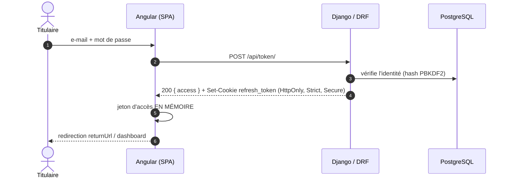
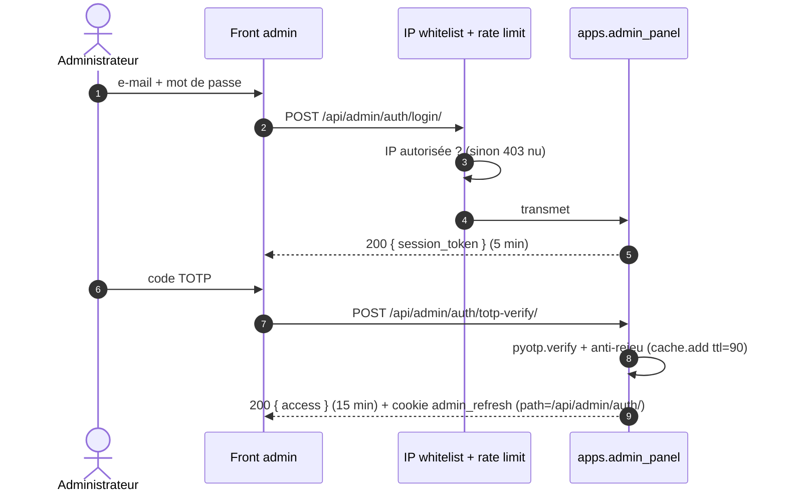

# 08 — Sécurité & conformité

> **Activité-type DWWM :** les deux blocs exigent une application **« sécurisée »**.
> Ce chapitre regroupe les mesures transverses ; les mécanismes locaux sont aussi
> décrits dans les chapitres [05](05-frontend-angular.md) et [06](06-backend-django.md).

## 8.1 Contexte : données de santé

La messagerie d'équipe véhicule des **échanges relatifs à des patients** (préparations,
posologies, cas comptoir). Ce sont des **données de santé à caractère personnel** au
sens du RGPD. Conséquences retenues :

- hébergement en **France** (Scalingo, région `osc-fr1`) ;
- **chiffrement au repos** du contenu des messages et de l'objet des conversations ;
- Sentry configuré pour **ne jamais capturer** le corps des requêtes ni les variables
  locales des *stack traces* (où transiterait du contenu déchiffré) ;
- purge et anonymisation pilotées par des tâches planifiées.

> Le passage à un hébergement **certifié HDS** est identifié comme prérequis avant
> exploitation réelle — voir [chapitre 12](12-limites-dette-roadmap.md).

## 8.2 Authentification — deux systèmes étanches

### a) Pharmacie & collaborateur — SimpleJWT

| Aspect | Détail |
|---|---|
| Jeton d'accès | 1 h, transmis en `Authorization: Bearer` |
| Jeton de *refresh* | 7 j, **cookie HttpOnly `SameSite=Strict` `Secure`** — jamais exposé au JavaScript |
| Rotation | `ROTATE_REFRESH_TOKENS` + `BLACKLIST_AFTER_ROTATION` (un *refresh* consommé est invalidé) |
| Session collaborateur | jeton **30 min, non renouvelable**, émis après vérification du PIN, portant les *claims* `auth_type='collaborator'`, `collaborator_id` et les 8 permissions `can_*` |
| Cookie annexe | `session_info` (non-HttpOnly, JSON) : permet au SPA de réafficher l'état après rechargement sans exposer de secret |

**PIN collaborateur** (`apps/team/models.py:123`) — anti-force brute :

```python
PIN_MAX_ATTEMPTS = 5
PIN_LOCKOUT_MINUTES = 15

def register_pin_failure(self):
    self.pin_fail_count += 1
    if self.pin_fail_count >= self.PIN_MAX_ATTEMPTS:
        self.pin_locked_until = timezone.now() + timedelta(minutes=self.PIN_LOCKOUT_MINUTES)
        self.pin_fail_count = 0
        self.save(update_fields=["pin_fail_count", "pin_locked_until"])
        return True
    self.save(update_fields=["pin_fail_count"])
    return False
```

Verrou porté par **le collaborateur cible** (pas la session appelante), donc partagé
entre `login` et `verify-pin`. Chaque tentative est journalisée
(`CollaboratorLoginLog`, index partiel sur les échecs).

### b) Back-office admin — JWT maison + TOTP

Complètement séparé (`apps/admin_panel/`) :

- Jetons signés avec **`ADMIN_JWT_SECRET`**, indépendant de `SECRET_KEY` (audit `E1` —
  avant, une fuite de `SECRET_KEY` permettait de forger des jetons admin *et* de
  déchiffrer les secrets TOTP).
- Trois types de jetons : `admin_session` (5 min, autorise seulement la vérification
  TOTP), `admin` (15 min, avec `jti`), `admin_refresh` (1 j, avec `jti`).
- **2FA TOTP obligatoire** (`pyotp`). Connexion en deux temps : mot de passe →
  `session_token` → code TOTP → jeton d'accès + cookie *refresh* limité au chemin
  `/api/admin/auth/`. Anti-rejeu du code via `cache.add(clé_code, ttl=90)` (audit `M5`).
- Secret TOTP stocké **chiffré (Fernet)**.
- **Rotation + liste de révocation** : à chaque *refresh*, l'ancien `jti` est blacklisté
  dans le cache **`admin_revocation`** (Redis natif, **fail-closed** : si Redis ne
  répond pas, le jeton est refusé — audit `S21`).
- **Liste blanche d'IP** : `AdminIPWhitelistMiddleware` (premier middleware) bloque
  `/api/admin/` et `/admin/` si l'IP cliente n'est pas dans `ADMIN_ALLOWED_IPS`. L'IP
  réelle est lue depuis la **droite** de la chaîne `X-Forwarded-For` en sautant
  `ADMIN_TRUSTED_PROXY_COUNT` entrées (anti-usurpation, audit `E2`).
- **Rate limiting par IP** dédié (`AdminRateLimitMiddleware`), indépendant de DRF.
- **Guard de provisionnement** (`AdminAccountGuardMiddleware`) : force le changement
  du mot de passe initial puis la configuration TOTP avant tout accès.

### Schémas de séquence

**Connexion pharmacie (titulaire)**



**Connexion collaborateur (PIN)**

```mermaid
sequenceDiagram
    autonumber
    actor C as Collaborateur
    participant NG as Angular (SPA)
    participant API as Django / DRF
    C->>NG: sélectionne son profil, saisit son PIN
    NG->>API: POST /api/team/login/ { collaborator_id, pin }
    alt PIN verrouillé
        API-->>NG: 423 Locked
    else PIN incorrect
        API->>API: register_pin_failure() + CollaboratorLoginLog
        API-->>NG: 403 Forbidden
    else PIN correct
        API->>API: reset_pin_failures() ; jeton 30 min (auth_type=collaborator, can_*)
        API-->>NG: 200 { access }
    end
```

**Connexion administrateur (2FA TOTP)**



## 8.3 Chiffrement au repos et rotation de clés

`FIELD_ENCRYPTION_KEY` accepte une **liste** de clés Fernet séparées par des virgules
(`settings.py:366`). La première chiffre, toutes déchiffrent (**MultiFernet**).
Procédure de rotation :

1. `FIELD_ENCRYPTION_KEY = "nouvelle,ancienne"` ;
2. `python manage.py reencrypt_messaging` (re-chiffre tout avec la nouvelle) ;
3. retirer l'ancienne clé.

Champs concernés : `Message.content`, `Conversation.subject`, `AdminUser.totp_secret`.

## 8.4 Séparation offre gratuite / payante — le 402

Décision commerciale du 2026-07-19, encodée dans le code
(`apps/billing/permissions.py`) :

- **Tableau de bord gratuit, sans condition** : ressources, catégories, cartes,
  favoris, notes, profil officine, **gestion d'équipe**. Aucune de ces vues ne porte
  `HasPaidAccess`. Un test (`apps/billing/tests/test_free_tier.py`) **verrouille**
  cette garantie.
- **Modules payants** (planning, qualité, tâches, messagerie, SMS) : ouverts pendant
  l'essai de 30 j, puis abonnement requis.
- Un accès refusé **ne déconnecte jamais** : réponse **HTTP 402** sur les seuls
  endpoints payants, équivalent WebSocket = **code de fermeture 4402**. Le front
  affiche un toast et renvoie vers la facturation.

```python
class PaymentRequired(APIException):
    status_code = status.HTTP_402_PAYMENT_REQUIRED
    default_code = 'payment_required'

class HasPaidAccess(BasePermission):
    def has_permission(self, request, view):
        subscription = Subscription.objects.filter(pharmacy=request.user).first()
        if subscription is None:
            raise PaymentRequired(detail="Aucun abonnement. Démarrez votre essai gratuit.")
        if not subscription.is_access_allowed:
            raise PaymentRequired(detail=_DENIAL_MESSAGES.get(subscription.access_denied_reason, ...))
        return True
```

## 8.5 Durcissement HTTP

| Mesure | Mise en œuvre |
|---|---|
| HSTS 1 an + `preload` + sous-domaines | `settings.py`, actif si `not DEBUG` |
| Redirection HTTPS, cookies `Secure` | idem |
| `X-Frame-Options: DENY`, `X-Content-Type-Options: nosniff` | `settings.py` |
| **CSP** stricte | `apps/core/middleware.ContentSecurityPolicyMiddleware` (dernier middleware) — autorise l'inline Angular, Stripe.js, le bucket Scaleway ; `frame-ancestors 'none'` |
| CORS | liste blanche d'origines (`CORS_ALLOWED_ORIGINS`), `CORS_ALLOW_CREDENTIALS` pour le cookie *refresh* admin |
| Auth DRF = **JWT uniquement** | `SessionAuthentication` volontairement retiré pour éviter les conflits CSRF |
| Upload de fichiers | validation partagée `apps/core/upload_validation.validate_upload` (type MIME, taille — audit `M3`) |
| Médias | servis via `serve_protected_media` (contrôle JWT) ; en prod, bucket **privé** Scaleway à URLs signées 1 h |

## 8.6 WebSocket

- Jeton JWT en **sous-protocole**, jamais en *query string* (audit `S18/S19` — une URL
  finit dans les logs des proxys).
- `AllowedHostsOriginValidator` sur toute la pile ASGI (anti-CSWSH, audit `S22`).
- Chaque *consumer* revérifie l'abonnement (`pharmacy_has_paid_access`) et l'adhésion
  à la conversation ; limiteur de débit intégré.

## 8.7 RGPD — cycle de vie des données

| Obligation | Mise en œuvre |
|---|---|
| Droit à l'effacement | `deletion_requested_at` / `deletion_scheduled_for` sur `Pharmacy` ; tâche beat nocturne `execute_scheduled_deletions` (02:30) qui anonymise (`anonymized_at`) ; annulation possible avant échéance |
| Minimisation | numéros de téléphone SMS stockés en **SHA-256** uniquement ; `SMSLog` purgé après **30 jours** (`cleanup_old_sms_logs`) |
| Non-fuite via la supervision | Sentry `send_default_pii=False` + `max_request_body_size="never"` + `include_local_variables=False` (audit `C23/C24`) |
| Traçabilité admin | `AdminAuditLog` (login, changements de ressources, validations de recommandations, actions de facturation) + fichier `admin_audit.log` en rotation |
| Résilience de la révocation | cache `admin_revocation` fail-closed (`S21`) |

## 8.8 Traçabilité des audits de sécurité

Le codebase a fait l'objet de **plusieurs revues de sécurité successives**. Plutôt
qu'un rapport externe, les corrections sont **inscrites dans le code** sous forme de
commentaires identifiés, et couvertes par des **tests de non-régression datés** :

| Famille | Exemples | Tests |
|---|---|---|
| `C1`–`C24` — critiques | `C3` clé faible refusée au boot, `C4` XSS stocké (DOMPurify), `C19` numérotation de facture concurrente, `C21` remboursement SMS atomique, `C23/C24` fuite Sentry | `test_audit_idor_20260709.py`, `test_hardening_20260710.py` |
| `E1`–`E5` — auth / crypto | `E1` secrets admin dédiés, `E2` IP réelle anti-spoof, `E4` verrou PIN, `E5` chiffrement messagerie | `test_auth.py`, `apps/team/tests/test_views_security.py` |
| `M2`–`M5` — moyens | `M2` webhook SMS fail-closed + HMAC, `M3` validation d'upload, `M5` anti-rejeu TOTP | `test_revocation_failclosed.py` |
| `S18`–`S22` — WebSocket | jeton en sous-protocole, `AllowedHostsOriginValidator` | `test_ws_*_handshake.py` |
| `Q03`–`Q05` — facturation | `Q04` anti-rejeu de souscription, `Q05` capture de la période facturée | `apps/billing/tests/test_confirm_replay.py`, `test_webhook.py` |

Un scan **OWASP ZAP** hebdomadaire (`.github/workflows/zap-scan.yml`) complète le
dispositif (voir [chapitre 11](11-tests-qualite.md)).
