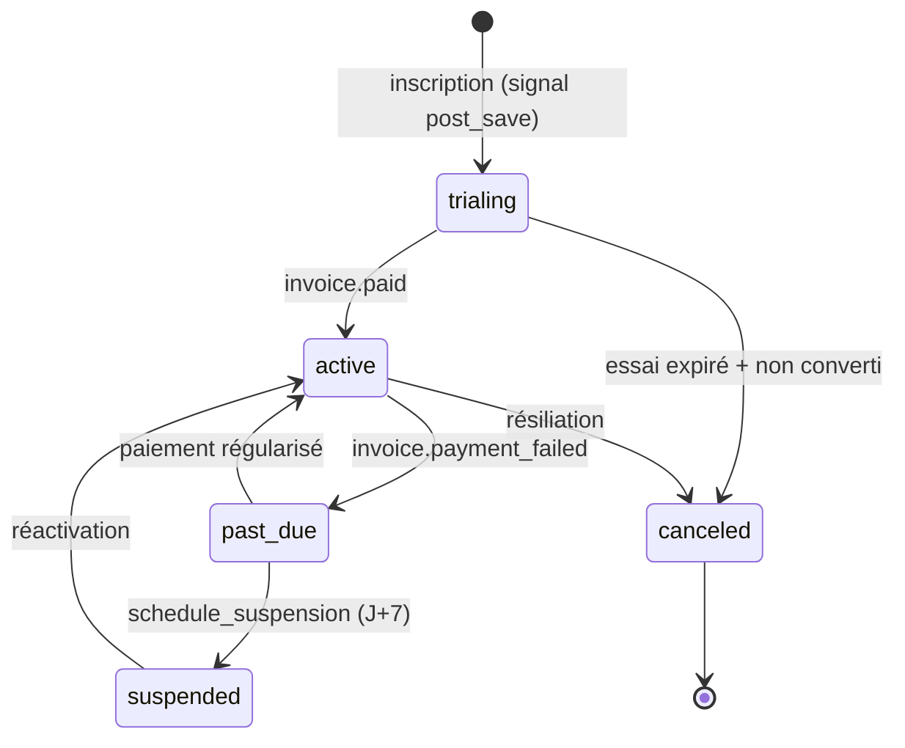

# 09 — Modules transverses

Trois sous-systèmes traversent toutes les fonctionnalités : la **facturation**, les
**SMS** et l'**assistant IA**.

## 9.1 Facturation — Stripe

App `apps/billing/`. Moyen de paiement = **prélèvement SEPA** (`sepa_debit`).

### Modèle de cycle de vie



- **Tout compte naît avec un abonnement.** Un signal `post_save` sur `Pharmacy`
  (`apps/billing/signals.py`) crée un `Subscription` en `trialing` (fin d'essai à
  J+30). Une migration de données a *backfillé* les comptes antérieurs.
- **Le droit d'accès est calculé sur les dates**, pas seulement sur le statut
  (`apps/billing/models.py:71`) :

```python
@property
def is_access_allowed(self):
    now = timezone.now()
    if self.status == self.Status.ACTIVE:
        return True
    if self.status == self.Status.TRIALING:
        return self.trial_ends_at is None or self.trial_ends_at > now
    if self.status == self.Status.PAST_DUE:
        return (self.past_due_since is None
                or now - self.past_due_since < self.PAST_DUE_GRACE)   # 7 jours
    return False   # SUSPENDED, CANCELED
```

Conséquence : un essai expiré perd l'accès **même si aucune tâche Celery n'est passée**
basculer le statut. Robuste à une panne de worker.

### Plans

| Plan | Cible | Prix indicatif |
|---|---|---|
| `small` | < 10 collaborateurs | [À COMPLÉTER — ~39 € HT/mois d'après la vitrine] |
| `large` | ≥ 10 collaborateurs | [À COMPLÉTER — ~59 € HT/mois d'après la vitrine] |

Le plan est déterminé au moment de la souscription d'après le nombre de collaborateurs
actifs ; une tâche nocturne (`check_plan_upgrades`) re-évalue le palier.

### Webhook Stripe

`POST /api/billing/webhook/stripe/` — `csrf_exempt`, **signature vérifiée avant tout
traitement** (`StripeService.construct_webhook_event`). Événements gérés :

| Événement | Effet |
|---|---|
| `invoice.paid` | statut → `active`, capture de la période facturée (audit `Q05`), enqueue génération PDF |
| `invoice.payment_failed` | statut → `past_due`, `past_due_since` posé une seule fois, e-mail, `schedule_suspension` à J+7 |
| `customer.subscription.updated` / `.deleted` | synchronisation du statut / résiliation |
| `customer.subscription.trial_will_end` | e-mail de fin d'essai |
| `payment_intent.succeeded` (pack SMS) | crédit du solde SMS (idempotent via `SmsCreditTransaction`) |

### Factures

`Invoice` — numérotation séquentielle `LLO-AAAA-000001`. La création réserve le numéro
**et** insère la ligne dans **une seule transaction** avec `SELECT FOR UPDATE` +
*retry* sur collision (audit `C19`, `apps/billing/models.py:204`). PDF généré par
**WeasyPrint**, stocké dans le bucket Scaleway, téléchargé via URL signée.

### Codes promo

`PromoCode` (N mois offerts après l'essai) + `PromoRedemption`
(`unique_together (promo_code, pharmacy)` — usage unique). Appliqué en étendant le
`trial_period_days` Stripe.

## 9.2 SMS

> **Fournisseur réel : SMS Partner** (`api.smspartner.fr`). La mémoire projet et
> `fichiers MD/TESTS.md` mentionnent « OVH » — terminologie historique, non conforme
> au code. Voir [chapitre 12](12-limites-dette-roadmap.md).

### Chaîne d'envoi

1. **Résolution du modèle** — `TemplateResolver` (`apps/core/services.py`) substitue
   `{{pharmacie.*}}`, `{{expediteur.*}}` (depuis le collaborateur) et les variables
   personnalisées ; renvoie l'aperçu et la liste des variables manquantes.
2. **Comptage** — `SMSPartnerService.count_sms` / `is_gsm7` : jeu de caractères GSM-7
   explicite. GSM-7 → 160 caractères (153 par segment concaténé) ; Unicode → 70 (67).
   L'aperçu renvoie l'encodage et le nombre de segments au front.
3. **Débit atomique** — `apps/core/views_sms.py` :
   `Pharmacy.objects.filter(sms_credits__gte=besoin).update(sms_credits=F('sms_credits') - besoin)`
   dans `transaction.atomic()`, avec création du `SMSLog` et de la
   `SmsCreditTransaction`. Solde insuffisant → **402**.
4. **Envoi asynchrone** — `send_sms_task` (Celery, 2 tentatives). Échec définitif →
   **remboursement** des crédits + transaction de type `refund`, dans un bloc atomique
   (audit `C21`).
5. **Accusé de réception** — webhook `GET/POST /api/sms/webhook/<token>/` :
   `AllowAny`, mais **fail-closed** (503 si `SMS_WEBHOOK_SECRET` absent) et token
   comparé en temps constant (`hmac.compare_digest`, audit `M2`). Met à jour le
   `SMSLog` (`DELIVERED` / `FAILED`) et pousse l'événement sur le groupe Channels
   `sms_status_{pharmacy_id}` → mise à jour temps réel du tableau de bord SMS.

### Confidentialité

Le numéro de téléphone n'est **jamais** stocké en clair : seul son SHA-256 (`to_hash`)
est conservé, et les logs sont purgés après 30 jours.

## 9.3 Assistant IA

- **Fournisseur : API Anthropic**, modèle `claude-sonnet-5`.
- **Génération de modèles de planning** (`apps/planning/tasks.generate_template_task`) :
  appel *streaming* (`client.messages.stream`, `thinking` adaptatif), exécuté dans
  Celery, résultat mis en cache, le front *polle* la complétion.
- **Assistant qualité** (`apps/quality/consumers.py` + `QualityAiWsService` côté front) :
  requête/réponse sur WebSocket `…/ws/quality/ai/`, corrélées par `request_id`,
  *timeout* 90 s. Utilisé pour l'aide à la rédaction de procédures et de
  non-conformités.
- **Assainissement** : toute sortie IA affichée en HTML riche passe par **DOMPurify**
  côté client (le contenu IA est traité comme non fiable — audit `C4`).
- Clé `ANTHROPIC_API_KEY` par l'environnement ; *throttle* dédié
  (`GenerateTemplateThrottle`).
