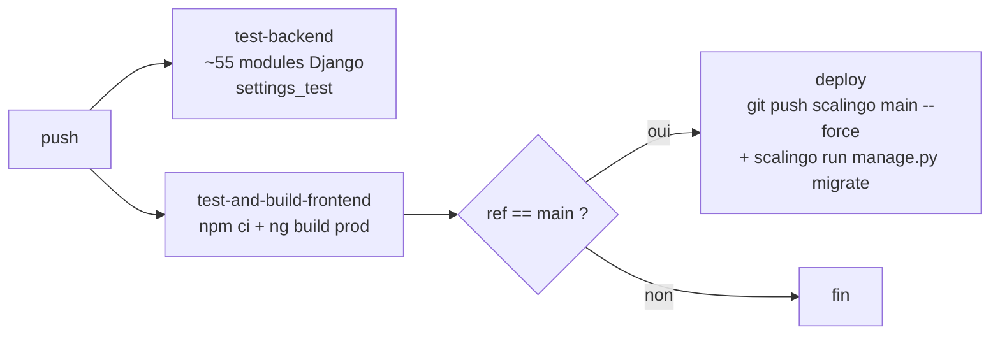

# 10 — Déploiement & exploitation

> **Référentiel :** **`C4.g`** préparer l'application pour la livraison (§10.4) ·
> **`C4.f`** (`Cr 4.f.2`, `Cr 4.f.3`) maîtrise de l'outil de versionnement et de la CI ·
> **`C5.b`** (`Cr 5.b.3`) variables d'environnement correctement renseignées (§10.5) ·
> **`C1.a`** déploiement complet et fonctionnel sur le serveur.
> Détail en [annexe](annexe-referentiel-competences.md).

## 10.1 Cible : Scalingo (PaaS français)

| Élément | Valeur |
|---|---|
| Plateforme | **Scalingo**, région `osc-fr1` (France) |
| Application | **une seule** app héberge le backend **et** le frontend |
| Conteneur `web` | **Daphne** (ASGI) — HTTP + WebSocket |
| Conteneur `worker` | **Celery** + Beat intégré (`--beat`) |
| Add-ons managés | PostgreSQL, Redis |
| Stockage objet | Scaleway Object Storage (bucket privé) |
| Runtime | Python **3.12** (`.python-version`) |

Choix d'un PaaS : au stade MVP, pas d'équipe ops ; hébergement en France pour l'enjeu
données de santé ; déploiement par `git push`, add-ons managés, TLS automatique.

## 10.2 Build — buildpacks et hook Angular

`.buildpacks` :

```
https://github.com/Scalingo/apt-buildpack       # libs système WeasyPrint (Aptfile)
https://github.com/Scalingo/python-buildpack     # Django
```

**Il n'y a pas de buildpack Node.** Angular est compilé par un *hook* du buildpack
Python, `bin/pre_compile`, exécuté avant `collectstatic` :

```bash
#!/bin/bash
set -e
echo "-----> Installing Node.js 22..."
curl -sL https://deb.nodesource.com/setup_22.x | bash -
apt-get install -y nodejs || { ... fallback binaire ... }

echo "-----> Building Angular frontend..."
cd frontend-lien-officinal
npm install --legacy-peer-deps
npx ng build --configuration production
```

Le bundle atterrit dans `frontend-lien-officinal/dist/frontend-lien-officinal/browser/`.
`settings.py` ajoute ce dossier à `STATICFILES_DIRS` s'il existe, et `WHITENOISE_ROOT`
le sert à la racine `/`. Une route attrape-tout Django renvoie `index.html` pour toute
URL non-API (routing SPA côté client).

`Aptfile` : bibliothèques natives de **WeasyPrint** (Pango, Cairo, gdk-pixbuf…) pour
la génération des PDF de facturation.

## 10.3 Procfile

```
release: python manage.py migrate --noinput && python manage.py collectstatic --noinput
web:     cd backend_lien_officinal && daphne -b 0.0.0.0 -p $PORT backend_lien_officinal.asgi:application
worker:  cd backend_lien_officinal && celery -A backend_lien_officinal worker --beat \
             --schedule=/tmp/celerybeat-schedule --loglevel=info --concurrency=2 \
             --max-tasks-per-child=10 --without-mingle --without-gossip
```

Trois points documentés dans le Procfile lui-même :

- **`--beat` dans le worker** : l'ordonnanceur tourne dans le process worker, pas dans
  un conteneur dédié. Sans lui, `CELERY_BEAT_SCHEDULE` n'était jamais lu — dont
  `execute_scheduled_deletions`, qui porte le **droit à l'effacement RGPD**.
- **⚠️ Le worker doit rester à UN conteneur.** Chaque conteneur embarquant son propre
  beat, en scaler deux dupliquerait toutes les tâches planifiées. Pour scaler, il
  faudrait d'abord extraire un type de process `beat:` séparé.
- **`--without-mingle --without-gossip`** : ces phases coordonnent plusieurs nœuds
  worker (inutile ici). `mingle` provoquait un `KeyError` reproductible à la
  reconnexion Redis (bug de course kombu/transport-redis, Sentry 2026-08-08).

- **`--schedule=/tmp/…`** : le disque Scalingo est éphémère, on n'écrit pas le fichier
  d'état de beat dans l'arborescence applicative.

> ⚠️ **La phase `release:` n'est PAS exécutée** par Scalingo sur cette application
> (vérifié : aucun conteneur release, `500 UndefinedColumn` en cas de migration
> oubliée). Les migrations sont donc appliquées **depuis la CI** (voir ci-dessous).

## 10.4 CI/CD — GitHub Actions

### `ci.yml` — déclenché sur **toutes** les branches (`push: '**'`)



| Job | Contenu | Secrets |
|---|---|---|
| **`test-backend`** | Python 3.12, `pip install`, libs WeasyPrint, puis une **liste explicite de ~55 modules de tests** (`manage.py test apps.planning.tests.… --settings=backend_lien_officinal.settings_test`) | `FIELD_ENCRYPTION_KEY` |
| **`test-and-build-frontend`** | Node 22, `npm ci --legacy-peer-deps`, `ng build --configuration production`. **Ne lance pas `ng test`.** | — |
| **`deploy`** (`needs: [test-and-build-frontend]`, `if: ref == main`) | `webfactory/ssh-agent`, `git push scalingo main --force`, installation du CLI Scalingo, `scalingo run -- manage.py migrate --noinput` (timeout 300 s) | `SCALINGO_SSH_KEY`, `SCALINGO_APP_NAME`, `SCALINGO_API_TOKEN` |

### `zap-scan.yml` — sécurité automatisée

Push sur `main`/`dev`, `workflow_dispatch`, **cron hebdomadaire** (lundi 6 h).
`continue-on-error: true` (rapport, non bloquant). Monte Postgres 16 + Redis 7,
lance l'app, puis `zaproxy/action-baseline` contre `http://localhost:8000` avec
`.github/zap-rules.tsv` (8 réglages : ignore les faux positifs « lib JS vulnérable »
sur les bundles Angular, ignore l'absence de jeton anti-CSRF pour une API JWT, etc.).
Artéfact `zap-report` conservé 30 jours.

### Dependabot

`.github/dependabot.yml` : mises à jour hebdomadaires `pip`, `npm`, `github-actions`
(10 PR max chacune).

### Faiblesses assumées du pipeline

Décrites en détail au [chapitre 12](12-limites-dette-roadmap.md) :
`deploy` ne dépend **que** du build frontend (pas des tests backend) ;
`git push --force` ; le job « frontend » ne teste pas ; la liste des tests backend
est maintenue **à la main** en double (`ci.yml` + `backend_lien_officinal/Makefile`).

## 10.5 Configuration par environnement

Aucun fichier `.env.example` dans le dépôt. Variables attendues côté backend :

| Domaine | Variables |
|---|---|
| Django | `DEBUG`, `SECRET_KEY`, `ALLOWED_HOSTS`, `CORS_ALLOWED_ORIGINS`, `DJANGO_LOG_LEVEL` |
| Crypto / admin | `FIELD_ENCRYPTION_KEY` (liste), `ADMIN_JWT_SECRET`, `ADMIN_TOTP_KEY`, `ADMIN_ALLOWED_IPS`, `ADMIN_TRUSTED_PROXY_COUNT` |
| Data | `DATABASE_URL`, `SCALINGO_REDIS_URL` (ou `REDIS_URL`) |
| Stockage | `SCW_ACCESS_KEY`, `SCW_SECRET_KEY`, `SCW_BUCKET_NAME`, `SCW_REGION` |
| E-mail | `MAILGUN_API_KEY`, `MAILGUN_DOMAIN`, `FRONTEND_BASE_URL`, `ADMIN_NOTIFICATION_EMAIL` |
| SMS | `SMSPARTNER_API_KEY`, `SMSPARTNER_SENDER`, `SMS_WEBHOOK_SECRET` |
| Paiement | `STRIPE_SECRET_KEY`, `STRIPE_PUBLISHABLE_KEY`, `STRIPE_WEBHOOK_SECRET`, `STRIPE_PRICE_SMALL`, `STRIPE_PRICE_LARGE` |
| IA | `ANTHROPIC_API_KEY` |
| Supervision | `SENTRY_DSN` (optionnel) |

Frontend : `src/environments/environment.prod.ts` (`apiUrl` / `wsUrl` vides →
même origine ; `stripePk` — voir [chapitre 12](12-limites-dette-roadmap.md)).

## 10.6 Site vitrine (application séparée)

`www.lienofficinal.fr` = site **Astro 5** statique, **dépôt Git distinct**
(`Inostra38/lienofficinal-vitrine`), physiquement imbriqué dans le monorepo mais
`gitignore`. Application Scalingo dédiée servant les fichiers statiques via un petit
serveur `sirv` (en-têtes de sécurité, cache immuable sur `/_astro/`, redirection
`apex → www`). Aucun lien de code avec la plateforme.

## 10.7 Supervision & exploitation courante

- **Sentry** (si `SENTRY_DSN` défini) — erreurs backend + worker, sans PII.
- **Journaux** : `console` (Scalingo), plus un fichier `admin_audit.log` en rotation
  pour la traçabilité du back-office.
- **Base de données** : sauvegardes gérées par l'add-on PostgreSQL Scalingo. Les
  dumps locaux (`backup_*.json`, `*.sql`) sont **explicitement `gitignore`** avec
  justification « peuvent contenir des données de santé en clair ».
- **Migrations en production** : appliquées à la main / par la CI via
  `scalingo run manage.py migrate` (cf. §10.3).
