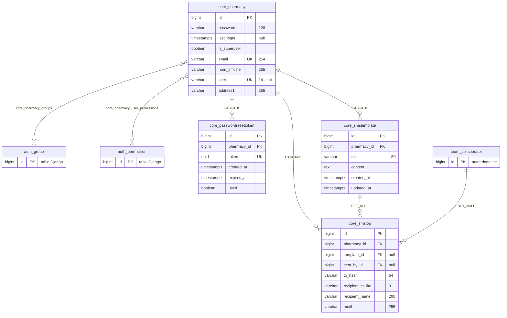
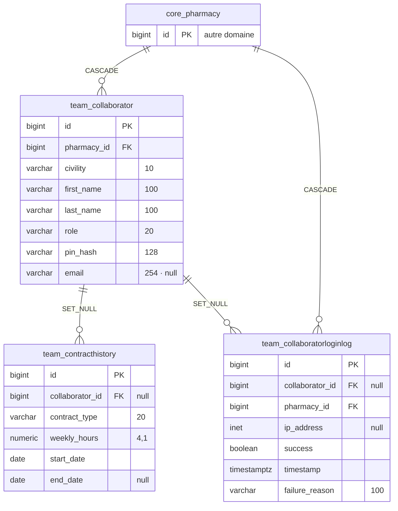
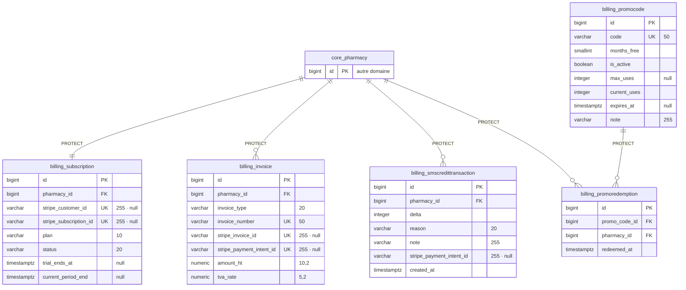
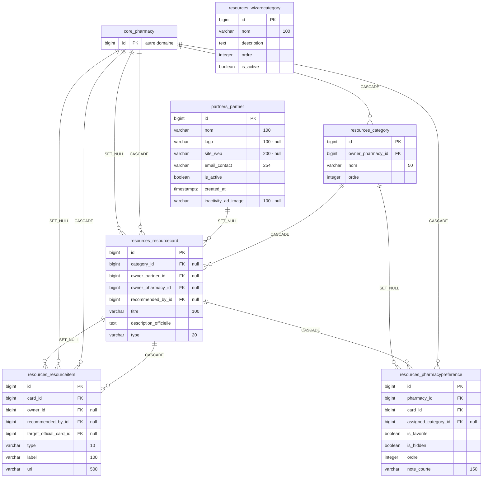
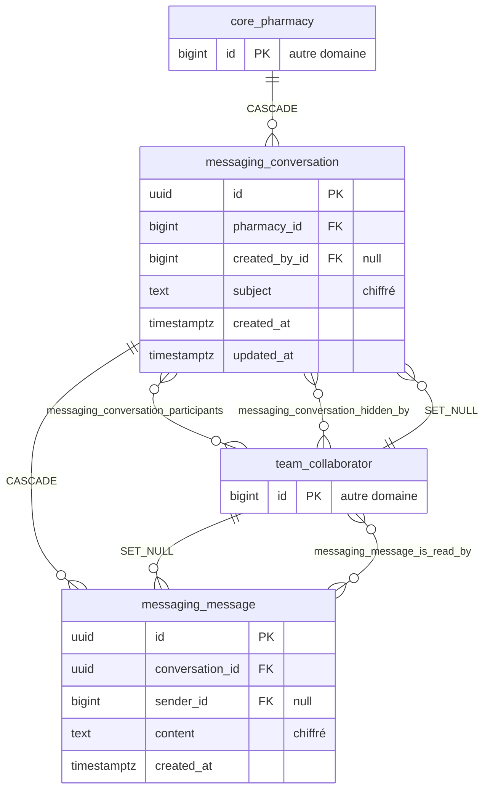
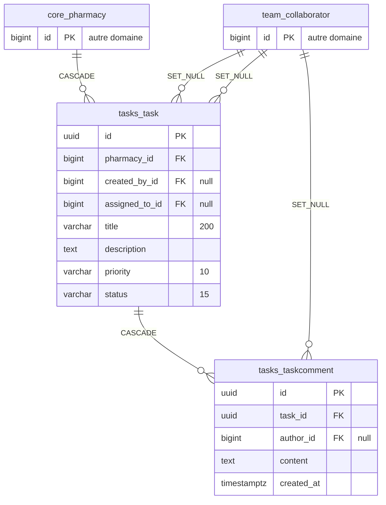
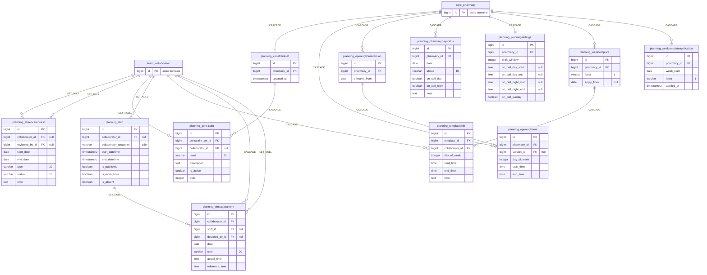
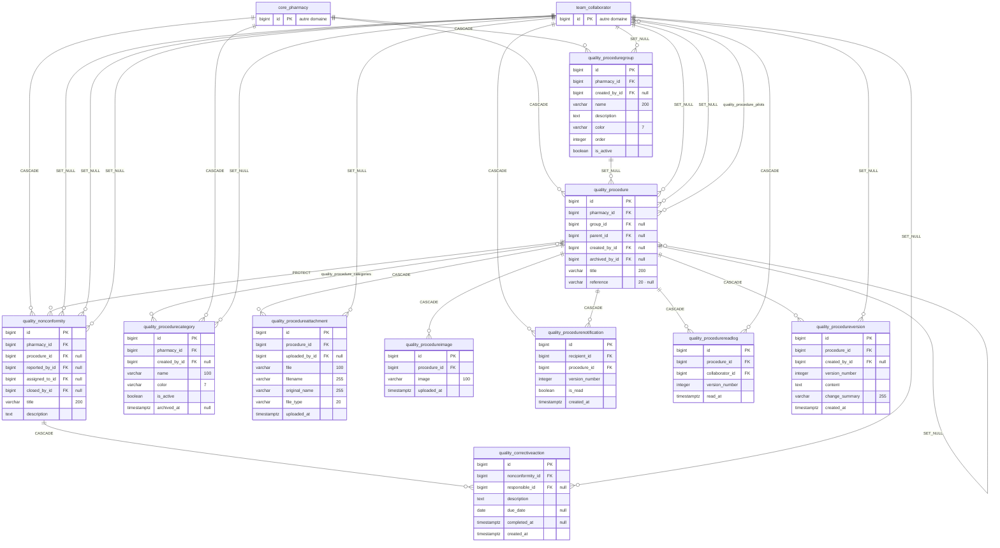
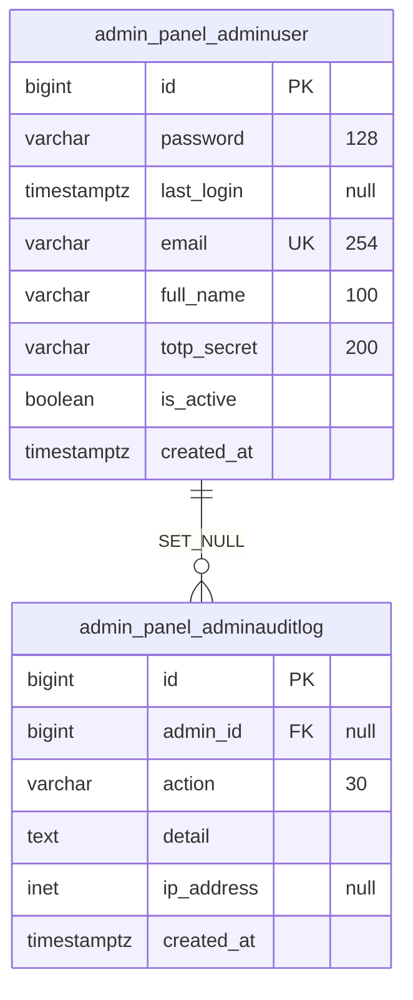

# Annexe A3 — Schéma physique de la base (MPD)

> **Référentiel — bloc 2 :** cette annexe est le **schéma physique** attendu parmi les
> éléments demandés (`C3.a`, `Cr 3.a.2` — « les données sont retranscrites sur un schéma
> décrivant les différentes tables et les relations entre elles » ; `C3.b` — construction
> de la base). Le **schéma conceptuel** est au [chapitre 07](07-modele-de-donnees.md).

## A3.1 Méthode d'obtention

Ce schéma est **généré depuis les modèles Django avec le backend PostgreSQL**, et non
recopié à la main : les noms de tables, les noms de colonnes, les types et les
contraintes sont ceux que Django émet réellement en production.

La base de développement locale a trois migrations non appliquées au moment de la
génération ; l'introspecter aurait donné un schéma périmé. En revanche
`makemigrations --check` ne détecte **aucune dérive** entre les modèles et les
migrations : les modèles font donc autorité sur le schéma cible, qui est celui
déployé en production.

## A3.2 Chiffres clés

| Élément | Nombre |
|---|---|
| Tables applicatives | **46** |
| Colonnes | **420** |
| Clés étrangères | **79** |
| Tables de liaison (relations N-N) | 7 |
| Contraintes `CHECK` déclarées | 8 |
| Contraintes `UNIQUE` nommées | 3 |
| Unicités composites (`unique_together`) | 11 |
| Index déclarés explicitement | 17 |

La base complète compte **62 tables** : les 46 ci-dessus plus celles de Django
(`auth_*`, `django_*`) et de la liste noire de jetons (`token_blacklist_*`).
PostgreSQL porte au total **28 contraintes `CHECK`** : les 8 déclarées explicitement,
plus celles que Django ajoute automatiquement pour chaque champ entier positif
(`PositiveIntegerField` → `CHECK (colonne >= 0)`).

## A3.3 Conventions Django → PostgreSQL

| Convention | Règle | Exemple |
|---|---|---|
| Nom de table | `<app>_<modèle en minuscules>` | `Collaborator` de l'app `team` → `team_collaborator` |
| Clé primaire | `id bigint GENERATED BY DEFAULT AS IDENTITY` (`DEFAULT_AUTO_FIELD = BigAutoField`) | toutes les tables sauf UUID |
| Clé primaire UUID | `uuid` explicite | `messaging_conversation`, `messaging_message`, `tasks_task` |
| Clé étrangère | colonne `<champ>_id`, contrainte `FOREIGN KEY … DEFERRABLE INITIALLY DEFERRED` | `pharmacy_id` |
| Relation N-N | table de liaison automatique `<table>_<champ>` | `quality_procedure_pilots` |
| Date/heure | `timestamp with time zone` (projet en `USE_TZ = True`) | `created_at` |
| Énumération | `varchar(n)` + contrainte `CHECK … IN (…)` | `billing_subscription.status` |
| Champ chiffré | `text` — le chiffrement Fernet est applicatif, invisible du SGBD | `messaging_message.content` |

## A3.4 Inventaire des tables par domaine

### Authentification, officine et SMS

| Table | Modèle | Colonnes | FK |
|---|---|---|---|
| `core_pharmacy` | `Pharmacy` | 32 | 0 |
| `core_passwordresettoken` | `PasswordResetToken` | 6 | 1 |
| `core_smstemplate` | `SMSTemplate` | 6 | 1 |
| `core_smslog` | `SMSLog` | 13 | 3 |

### Équipe

| Table | Modèle | Colonnes | FK |
|---|---|---|---|
| `team_collaborator` | `Collaborator` | 25 | 1 |
| `team_contracthistory` | `ContractHistory` | 6 | 1 |
| `team_collaboratorloginlog` | `CollaboratorLoginLog` | 7 | 2 |

### Facturation

| Table | Modèle | Colonnes | FK |
|---|---|---|---|
| `billing_subscription` | `Subscription` | 13 | 1 |
| `billing_invoice` | `Invoice` | 12 | 1 |
| `billing_smscredittransaction` | `SmsCreditTransaction` | 7 | 1 |
| `billing_promocode` | `PromoCode` | 10 | 0 |
| `billing_promoredemption` | `PromoRedemption` | 4 | 2 |

### Ressources (tableau de bord)

| Table | Modèle | Colonnes | FK |
|---|---|---|---|
| `resources_wizardcategory` | `WizardCategory` | 5 | 0 |
| `resources_category` | `Category` | 4 | 1 |
| `resources_resourcecard` | `ResourceCard` | 15 | 4 |
| `resources_resourceitem` | `ResourceItem` | 13 | 4 |
| `resources_pharmacypreference` | `PharmacyPreference` | 10 | 3 |
| `partners_partner` | `Partner` | 11 | 0 |

### Messagerie

| Table | Modèle | Colonnes | FK |
|---|---|---|---|
| `messaging_conversation` | `Conversation` | 6 | 2 |
| `messaging_message` | `Message` | 5 | 2 |

### Tâches

| Table | Modèle | Colonnes | FK |
|---|---|---|---|
| `tasks_task` | `Task` | 16 | 3 |
| `tasks_taskcomment` | `TaskComment` | 5 | 2 |

### Planning

| Table | Modèle | Colonnes | FK |
|---|---|---|---|
| `planning_absencerequest` | `AbsenceRequest` | 14 | 2 |
| `planning_constraint` | `Constraint` | 7 | 2 |
| `planning_constraintset` | `ConstraintSet` | 3 | 1 |
| `planning_openinghours` | `OpeningHours` | 6 | 2 |
| `planning_openinghoursversion` | `OpeningHoursVersion` | 3 | 1 |
| `planning_pharmacydaystatus` | `PharmacyDayStatus` | 7 | 1 |
| `planning_planningsettings` | `PlanningSettings` | 8 | 1 |
| `planning_shift` | `Shift` | 13 | 1 |
| `planning_templateshift` | `TemplateShift` | 7 | 2 |
| `planning_timeadjustment` | `TimeAdjustment` | 11 | 3 |
| `planning_weektemplate` | `WeekTemplate` | 4 | 1 |
| `planning_weektemplateapplication` | `WeekTemplateApplication` | 5 | 1 |

### Qualité

| Table | Modèle | Colonnes | FK |
|---|---|---|---|
| `quality_correctiveaction` | `CorrectiveAction` | 7 | 2 |
| `quality_nonconformity` | `NonConformity` | 13 | 5 |
| `quality_procedure` | `Procedure` | 16 | 5 |
| `quality_procedureattachment` | `ProcedureAttachment` | 8 | 2 |
| `quality_procedurecategory` | `ProcedureCategory` | 7 | 2 |
| `quality_proceduregroup` | `ProcedureGroup` | 11 | 2 |
| `quality_procedureimage` | `ProcedureImage` | 4 | 1 |
| `quality_procedurenotification` | `ProcedureNotification` | 6 | 2 |
| `quality_procedurereadlog` | `ProcedureReadLog` | 5 | 2 |
| `quality_procedureversion` | `ProcedureVersion` | 7 | 2 |

### Back-office administrateur

| Table | Modèle | Colonnes | FK |
|---|---|---|---|
| `admin_panel_adminauditlog` | `AdminAuditLog` | 6 | 1 |
| `admin_panel_adminuser` | `AdminUser` | 11 | 0 |

## A3.5 Schémas relationnels par domaine

Noms de tables et types **physiques** réels. Les libellés de relation portent la règle
`ON DELETE`. Les tables les plus larges n'affichent que leur clé primaire, leurs clés
étrangères et quelques colonnes métier.

### Authentification, officine et SMS



### Équipe



### Facturation



### Ressources (tableau de bord)



### Messagerie



### Tâches



### Planning



### Qualité



### Back-office administrateur



## A3.6 Détail colonne par colonne — tables du cœur

### `core_pharmacy`  ·  modèle `Pharmacy`  ·  32 colonnes

| Colonne | Type PostgreSQL | Null | Clé | Note |
|---|---|---|---|---|
| `id` | `bigint` | non | **PK** |  |
| `password` | `varchar(128)` | non |  |  |
| `last_login` | `timestamp with time zone` | oui |  |  |
| `is_superuser` | `boolean` | non |  |  |
| `email` | `varchar(254)` | non | UNIQUE |  |
| `nom_officine` | `varchar(255)` | non |  |  |
| `siret` | `varchar(14)` | oui | UNIQUE |  |
| `address1` | `varchar(255)` | non |  |  |
| `address2` | `varchar(255)` | non |  |  |
| `postal_code` | `varchar(10)` | non |  |  |
| `city` | `varchar(100)` | non |  |  |
| `region` | `varchar(100)` | non |  | valeurs : `Auvergne-Rhône-Alpes`, `Bourgogne-Franche-Comté`, `Bretagne`, `Centre-Val de Loire`, `Corse`, `Grand Est` |
| `country` | `varchar(100)` | non |  |  |
| `raison_sociale` | `varchar(255)` | non |  |  |
| `vat_number` | `varchar(20)` | non |  |  |
| `phone_fixe` | `varchar(20)` | non |  |  |
| `phone_mobile` | `varchar(20)` | non |  |  |
| `sms_credits` | `integer` | non |  |  |
| `pharmacy_type` | `varchar(20)` | non |  | valeurs : `urbaine`, `rurale`, `centre-bourg`, `centre-commercial` |
| `logo` | `varchar(100)` | oui |  |  |
| `pending_email` | `varchar(254)` | oui |  |  |
| `email_verification_token` | `uuid` | oui |  |  |
| `email_verification_expires` | `timestamp with time zone` | oui |  |  |
| `email_verified` | `boolean` | non |  |  |
| `is_premium` | `boolean` | non |  |  |
| `is_active` | `boolean` | non |  |  |
| `onboarding_completed` | `boolean` | non |  |  |
| `is_staff` | `boolean` | non |  |  |
| `date_joined` | `timestamp with time zone` | non |  |  |
| `deletion_requested_at` | `timestamp with time zone` | oui |  |  |
| `deletion_scheduled_for` | `timestamp with time zone` | oui |  |  |
| `anonymized_at` | `timestamp with time zone` | oui |  |  |

### `team_collaborator`  ·  modèle `Collaborator`  ·  25 colonnes

| Colonne | Type PostgreSQL | Null | Clé | Note |
|---|---|---|---|---|
| `id` | `bigint` | non | **PK** |  |
| `pharmacy_id` | `bigint` | non | FK | → `core_pharmacy` · `ON DELETE CASCADE` |
| `civility` | `varchar(10)` | non |  | valeurs : `M.`, `Mme`, `Autre` |
| `first_name` | `varchar(100)` | non |  |  |
| `last_name` | `varchar(100)` | non |  |  |
| `role` | `varchar(20)` | non |  | valeurs : `Titulaire`, `Adjoint`, `Préparateur`, `Étudiant`, `Apprenti` |
| `pin_hash` | `varchar(128)` | non |  |  |
| `email` | `varchar(254)` | oui |  |  |
| `color` | `varchar(7)` | non |  |  |
| `can_manage_account` | `boolean` | non |  |  |
| `can_manage_team` | `boolean` | non |  |  |
| `can_manage_planning` | `boolean` | non |  |  |
| `can_manage_quality` | `boolean` | non |  |  |
| `can_manage_procedures` | `boolean` | non |  |  |
| `can_publish_procedures` | `boolean` | non |  |  |
| `can_close_nonconformities` | `boolean` | non |  |  |
| `can_assign_task` | `boolean` | non |  |  |
| `weekly_hours` | `numeric(4, 1)` | non |  |  |
| `is_tns` | `boolean` | non |  |  |
| `is_active` | `boolean` | non |  |  |
| `archived_at` | `timestamp with time zone` | oui |  |  |
| `created_at` | `timestamp with time zone` | non |  |  |
| `display_order` | `integer` | non |  |  |
| `pin_fail_count` | `integer` | non |  |  |
| `pin_locked_until` | `timestamp with time zone` | oui |  |  |

### `billing_subscription`  ·  modèle `Subscription`  ·  13 colonnes

| Colonne | Type PostgreSQL | Null | Clé | Note |
|---|---|---|---|---|
| `id` | `bigint` | non | **PK** |  |
| `pharmacy_id` | `bigint` | non | FK | → `core_pharmacy` · `ON DELETE PROTECT` |
| `stripe_customer_id` | `varchar(255)` | oui | UNIQUE |  |
| `stripe_subscription_id` | `varchar(255)` | oui | UNIQUE |  |
| `plan` | `varchar(10)` | non |  | valeurs : `small`, `large` |
| `status` | `varchar(20)` | non |  | valeurs : `trialing`, `active`, `past_due`, `suspended`, `canceled` |
| `trial_ends_at` | `timestamp with time zone` | oui |  |  |
| `current_period_end` | `timestamp with time zone` | oui |  |  |
| `past_due_since` | `timestamp with time zone` | oui |  |  |
| `suspended_at` | `timestamp with time zone` | oui |  |  |
| `cancel_at_period_end` | `boolean` | non |  |  |
| `created_at` | `timestamp with time zone` | non |  |  |
| `updated_at` | `timestamp with time zone` | non |  |  |

### `resources_pharmacypreference`  ·  modèle `PharmacyPreference`  ·  10 colonnes

| Colonne | Type PostgreSQL | Null | Clé | Note |
|---|---|---|---|---|
| `id` | `bigint` | non | **PK** |  |
| `pharmacy_id` | `bigint` | non | FK | → `core_pharmacy` · `ON DELETE CASCADE` |
| `card_id` | `bigint` | non | FK | → `resources_resourcecard` · `ON DELETE CASCADE` |
| `assigned_category_id` | `bigint` | oui | FK | → `resources_category` · `ON DELETE SET_NULL` |
| `is_favorite` | `boolean` | non |  |  |
| `is_hidden` | `boolean` | non |  |  |
| `ordre` | `integer` | non |  |  |
| `note_courte` | `varchar(150)` | non |  |  |
| `note_longue` | `text` | non |  |  |
| `updated_at` | `timestamp with time zone` | non |  |  |

### `planning_shift`  ·  modèle `Shift`  ·  13 colonnes

| Colonne | Type PostgreSQL | Null | Clé | Note |
|---|---|---|---|---|
| `id` | `bigint` | non | **PK** |  |
| `collaborator_id` | `bigint` | oui | FK | → `team_collaborator` · `ON DELETE SET_NULL` |
| `collaborator_snapshot` | `varchar(150)` | non |  |  |
| `start_datetime` | `timestamp with time zone` | non |  |  |
| `end_datetime` | `timestamp with time zone` | non |  |  |
| `is_published` | `boolean` | non |  |  |
| `is_extra_hour` | `boolean` | non |  |  |
| `is_absent` | `boolean` | non |  |  |
| `absence_type` | `varchar(20)` | oui |  | valeurs : `injustifiee`, `conge_exceptionnel`, `maladie`, `cp`, `rcr`, `sans_solde` |
| `note` | `text` | non |  |  |
| `contract_hours_snapshot` | `numeric(4, 1)` | oui |  |  |
| `created_at` | `timestamp with time zone` | non |  |  |
| `updated_at` | `timestamp with time zone` | non |  |  |

### `messaging_message`  ·  modèle `Message`  ·  5 colonnes

| Colonne | Type PostgreSQL | Null | Clé | Note |
|---|---|---|---|---|
| `id` | `uuid` | non | **PK** |  |
| `conversation_id` | `uuid` | non | FK | → `messaging_conversation` · `ON DELETE CASCADE` |
| `sender_id` | `bigint` | oui | FK | → `team_collaborator` · `ON DELETE SET_NULL` |
| `content` | `text` | non |  | **chiffré au repos (Fernet)** |
| `created_at` | `timestamp with time zone` | non |  |  |

## A3.7 Contraintes d'intégrité

### Contraintes `CHECK` déclarées

| Table | Nom de la contrainte | Règle |
|---|---|---|
| `billing_invoice` | `billing_invoice_type_valid` | `"invoice_type" IN ('subscription', 'sms_pack')` |
| `billing_invoice` | `billing_invoice_amount_ht_positive` | `"amount_ht" >= 0` |
| `billing_promocode` | `billing_promocode_months_free_min_1` | `"months_free" >= 1` |
| `billing_subscription` | `billing_subscription_plan_valid` | `"plan" IN ('small', 'large')` |
| `billing_subscription` | `billing_subscription_status_valid` | `"status" IN ('trialing', 'active', 'past_due', 'suspended', 'canceled')` |
| `core_pharmacy` | `pharmacy_sms_credits_non_negative` | `"sms_credits" >= 0` |
| `planning_shift` | `shift_end_after_start` | `"end_datetime" > ("start_datetime")` |
| `planning_timeadjustment` | `timeadj_duration_positive` | `"duration_minutes" > 0` |

### Contraintes `UNIQUE` nommées et unicités composites

| Table | Contrainte | Colonnes / condition |
|---|---|---|
| `billing_promoredemption` | `billing_promoredemption_unique_per_pharmacy` | `promo_code, pharmacy` |
| `billing_smscredittransaction` | `bill_sms_tx_pi_unique` | `stripe_payment_intent_id` · **partielle** : `stripe_payment_intent_id` IS NOT NULL |
| `core_smstemplate` | *unique_together* | `pharmacy, title` |
| `planning_openinghoursversion` | *unique_together* | `pharmacy, effective_from` |
| `planning_pharmacydaystatus` | *unique_together* | `pharmacy, date` |
| `planning_weektemplate` | *unique_together* | `pharmacy, letter` |
| `planning_weektemplateapplication` | *unique_together* | `pharmacy, week_start` |
| `quality_procedure` | `proc_unique_pharmacy_reference` | `pharmacy, reference` · **partielle** : `reference` IS NOT NULL |
| `quality_procedurecategory` | *unique_together* | `name, pharmacy` |
| `quality_proceduregroup` | *unique_together* | `name, pharmacy` |
| `quality_procedureversion` | *unique_together* | `procedure, version_number` |
| `resources_category` | *unique_together* | `owner_pharmacy, nom` |
| `resources_pharmacypreference` | *unique_together* | `pharmacy, card` |
| `team_collaborator` | *unique_together* | `pharmacy, first_name, last_name` |

### Index déclarés

| Table | Index | Colonnes | Partiel |
|---|---|---|---|
| `billing_invoice` | `bill_inv_phcy_date_idx` | `pharmacy, issued_at` | non |
| `billing_invoice` | `bill_inv_type_idx` | `invoice_type` | non |
| `billing_promocode` | `billing_promocode_code_idx` | `code` | non |
| `billing_promocode` | `billing_promocode_active_idx` | `is_active` | non |
| `billing_promoredemption` | `bill_promo_redempt_phcy_idx` | `pharmacy` | non |
| `billing_smscredittransaction` | `bill_sms_tx_phcy_date_idx` | `pharmacy, created_at` | non |
| `billing_subscription` | `bill_sub_status_idx` | `status` | non |
| `billing_subscription` | `bill_sub_trial_idx` | `trial_ends_at` | non |
| `billing_subscription` | `bill_sub_period_idx` | `current_period_end` | non |
| `planning_absencerequest` | `absence_collab_status_idx` | `collaborator, status, start_date` | non |
| `planning_shift` | `shift_start_idx` | `start_datetime` | non |
| `planning_shift` | `shift_collab_start_idx` | `collaborator, start_datetime` | non |
| `planning_timeadjustment` | `timeadj_collab_date_idx` | `collaborator, date` | non |
| `quality_procedure` | `proc_pharmacy_status_idx` | `pharmacy, status` | non |
| `quality_procedure` | `proc_active_idx` | `pharmacy` | oui |
| `team_collaboratorloginlog` | `loginlog_pharmacy_ts_idx` | `pharmacy, -timestamp` | non |
| `team_collaboratorloginlog` | `loginlog_failures_idx` | `pharmacy` | oui |

## A3.8 DDL réel — trois tables représentatives

SQL produit par Django pour PostgreSQL, sans retouche.

### `billing_subscription`

Énumérations contraintes par `CHECK`, unicité des identifiants Stripe, relation 1-1 avec la pharmacie.

```sql
CREATE TABLE "billing_subscription" (
    "id" bigint NOT NULL PRIMARY KEY GENERATED BY DEFAULT AS IDENTITY,
    "pharmacy_id" bigint NOT NULL UNIQUE,
    "stripe_customer_id" varchar(255) NULL UNIQUE,
    "stripe_subscription_id" varchar(255) NULL UNIQUE,
    "plan" varchar(10) NOT NULL,
    "status" varchar(20) NOT NULL,
    "trial_ends_at" timestamp with time zone NULL,
    "current_period_end" timestamp with time zone NULL,
    "past_due_since" timestamp with time zone NULL,
    "suspended_at" timestamp with time zone NULL,
    "cancel_at_period_end" boolean NOT NULL,
    "created_at" timestamp with time zone NOT NULL,
    "updated_at" timestamp with time zone NOT NULL,
    CONSTRAINT "billing_subscription_plan_valid" CHECK ("plan" IN ('small', 'large')),
    CONSTRAINT "billing_subscription_status_valid" CHECK ("status" IN ('trialing', 'active', 'past_due', 'suspended', 'canceled'))
);
```

### `resources_pharmacypreference`

La surcouche de personnalisation : unicité composite `(pharmacy, card)`, suppression en cascade.

```sql
CREATE TABLE "resources_pharmacypreference" (
    "id" bigint NOT NULL PRIMARY KEY GENERATED BY DEFAULT AS IDENTITY,
    "pharmacy_id" bigint NOT NULL,
    "card_id" bigint NOT NULL,
    "assigned_category_id" bigint NULL,
    "is_favorite" boolean NOT NULL,
    "is_hidden" boolean NOT NULL,
    "ordre" integer NOT NULL CHECK ("ordre" >= 0),
    "note_courte" varchar(150) NOT NULL,
    "note_longue" text NOT NULL,
    "updated_at" timestamp with time zone NOT NULL
);
```

### `team_collaborator`

Le PIN haché, les 8 permissions fonctionnelles et le verrou anti-force-brute.

```sql
CREATE TABLE "team_collaborator" (
    "id" bigint NOT NULL PRIMARY KEY GENERATED BY DEFAULT AS IDENTITY,
    "pharmacy_id" bigint NOT NULL,
    "civility" varchar(10) NOT NULL,
    "first_name" varchar(100) NOT NULL,
    "last_name" varchar(100) NOT NULL,
    "role" varchar(20) NOT NULL,
    "pin_hash" varchar(128) NOT NULL,
    "email" varchar(254) NULL,
    "color" varchar(7) NOT NULL,
    "can_manage_account" boolean NOT NULL,
    "can_manage_team" boolean NOT NULL,
    "can_manage_planning" boolean NOT NULL,
    "can_manage_quality" boolean NOT NULL,
    "can_manage_procedures" boolean NOT NULL,
    "can_publish_procedures" boolean NOT NULL,
    "can_close_nonconformities" boolean NOT NULL,
    "can_assign_task" boolean NOT NULL,
    "weekly_hours" numeric(4, 1) NOT NULL,
    "is_tns" boolean NOT NULL,
    "is_active" boolean NOT NULL,
    "archived_at" timestamp with time zone NULL,
    "created_at" timestamp with time zone NOT NULL,
    "display_order" integer NOT NULL CHECK ("display_order" >= 0),
    "pin_fail_count" integer NOT NULL CHECK ("pin_fail_count" >= 0),
    "pin_locked_until" timestamp with time zone NULL
);
```
